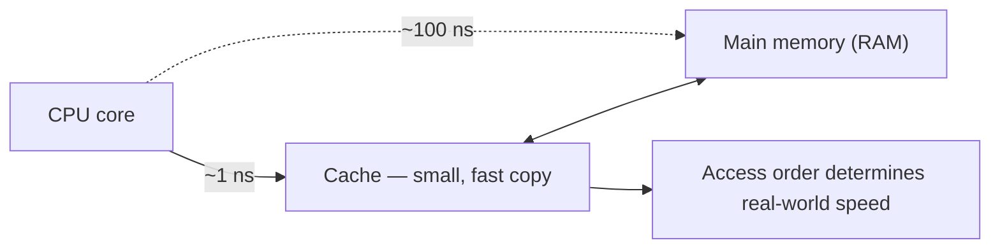

# Mermaid Revealer — AI Architecture & Master Prompt

**Companion docs:** [PRODUCT_SPEC.md](PRODUCT_SPEC.md) · [ARCHITECTURE.md](ARCHITECTURE.md) · [ENGINE_CHANGES.md](ENGINE_CHANGES.md)

---

## 1. The constraint that shapes everything

Your renderer is not a Mermaid viewer. It is an **incremental** Mermaid viewer. Reading `js/parser.js` and `js/render.js`:

1. The first non-blank, non-`%%` line becomes the **header** (`graph TD`, `sequenceDiagram`, …).
2. Every subsequent line becomes **one reveal step**. Nested blocks (`subgraph…end`, `alt/opt/loop…end`, `{…}`) collapse into a single atomic step.
3. At step *i*, the renderer calls `mermaid.render(header + steps[0..i])`.

Therefore: **every prefix of the diagram body must be independently valid, renderable, and visually meaningful.**

This is not a normal Mermaid generation task. A model asked for "a Mermaid diagram" will happily emit `A --> B` before declaring `A`, cram three ideas onto one line, or open a `subgraph` in the middle of unrelated edges. All of those produce broken or ugly frames in *your* renderer while looking perfectly fine in a static one.

Everything below — the diagram-type matrix, the line-level rules, the validation loop — exists to satisfy that one constraint.

---

## 2. Diagram type matrix (what the model is allowed to choose)

The model must not have a free choice of all 12 types. It has a gated choice.

### Tier A — full step reveal (`revealMode: "steps"`)

| Type | Use when | Reveal behaves as |
|---|---|---|
| `flowchart TD` / `LR` | Processes, architectures, decision logic, cause→effect. **Default.** | Each node/edge appears in causal order |
| `sequenceDiagram` | Protocols, request/response, multi-actor interactions over time | Each message appears in chronological order |
| `stateDiagram-v2` | Lifecycles, modes, finite state machines | Each state and transition appears |
| `mindmap` | Taxonomies, "the 6 kinds of X", conceptual breakdowns | Branches grow outward (parents must precede children) |
| `timeline` | History, chronology, version evolution | Events appear in time order |
| `erDiagram` | Data models, schema relationships | Each entity, then each relationship |
| `journey` | UX flows, "what the user experiences" | Each stage appears |
| `gitGraph` | Branching workflows, version control teaching | Each commit/branch/merge appears |
| `classDiagram` | OOP structure, type hierarchies, API surfaces | Each class block, then each relation |

### Tier B — atomic only (`revealMode: "atomic"`)

These render in a single step. Still useful as summary or data panels; **never** used for the main explanatory diagram.

| Type | Why it can't step-reveal |
|---|---|
| `pie` | A one-slice pie is 100%. Every added slice rescales everything. Reveal is actively misleading. |
| `quadrantChart` | Axis and quadrant declarations must all exist before any point renders; partial prefixes error out. |
| `sankey-beta` | Prefix-valid but the layout thrashes violently on every added row. |
| `xychart-beta` | Requires full axis configuration up front. |

### Not permitted

`block-beta`, `architecture-beta`, `C4Context`, `requirementDiagram`, `packet-beta` — version-fragile, poorly laid out, or unsupported in the pinned renderer version. Revisit individually with a rendering test before enabling.

> **Pin the Mermaid version and put it in the prompt.** The model will otherwise emit v11 syntax that fails on your v10.9.1 CDN build (`index.html:6`), or vice versa. Whatever version you pin in `package.json`, the same string goes in the system prompt and in the validator. Upgrading Mermaid is a `promptVersion` bump.

---

## 3. Pipeline overview

```
        transcript (raw, with timestamps)
                    │
        ┌───────────▼────────────┐
        │  0. PREPROCESS         │  deterministic code, $0
        │  clean · segment ·     │
        │  compress · timestamp  │
        └───────────┬────────────┘
                    │
        ┌───────────▼────────────┐
        │  1. OUTLINE            │  Haiku 4.5, effort: low
        │  → sections[] with     │  structured output
        │    type + revealMode   │  ~$0.02
        └───────────┬────────────┘
                    │
        ┌───────────▼────────────┐
        │  2. GENERATE (parallel)│  Sonnet 5, effort: high
        │  one call per section  │  transcript prompt-cached
        │  → mermaid + narration │  ~$0.15 total
        └───────────┬────────────┘
                    │
        ┌───────────▼────────────┐
        │  3. VALIDATE + REPAIR  │  code first, Haiku fallback
        │  every prefix renders  │  ~$0.007
        └───────────┬────────────┘
                    │
        ┌───────────▼────────────┐
        │  4. DERIVE (async)     │  Haiku, from narration only
        │  flashcards · quiz ·   │  ~$0.01
        │  embeddings · OG image │
        └────────────────────────┘
```

**Model assignment rationale** (verified prices, 2026-07):

| Stage | Model | $/MTok in/out | Why |
|---|---|---|---|
| Outline | `claude-haiku-4-5` | $1 / $5 | Structured extraction with a JSON schema. Doesn't need reasoning depth. |
| Generate (standard) | `claude-sonnet-5` | $3 / $15 | The quality-sensitive step. Sonnet 5 is near-Opus on structured generation at 60% of the price. |
| Generate (deep mode) | `claude-opus-5` | $5 / $25 | Studio tier. Visibly better on dense technical content and on choosing non-obvious diagram types. |
| Repair | `claude-haiku-4-5` | $1 / $5 | Mechanical syntax fixing. |
| Tutor / explain | `claude-haiku-4-5` → Sonnet on follow-up | | Most questions are shallow; escalate only when the first answer is rated unhelpful. |
| Flashcards / quiz | `claude-haiku-4-5` | | Input is the narration array (~1K tokens), not the transcript. |

Use adaptive thinking (`thinking: { type: "adaptive" }`) with `output_config: { effort }` set per stage. Do not use `budget_tokens` — it's removed on current models and returns a 400.

---

## 4. Stage 0 — Preprocessing (deterministic, $0)

Do as much as possible in code before spending a token.

```ts
function preprocess(raw: TranscriptSegment[]): PreparedTranscript
```

1. **Normalize** — collapse whitespace, fix mojibake, normalize quotes/dashes, strip `[Music]` / `[Applause]` / `>>` speaker markers.
2. **Strip filler** — a curated list (`um`, `uh`, `you know`, `like I said`, `basically`, `sort of`, `right?`) applied conservatively at word boundaries. Typically **15–25% token reduction with zero quality loss**.
3. **Drop sponsor segments** — the SponsorBlock API is free, community-maintained, and returns time ranges for sponsor/intro/outro/self-promo on a large fraction of popular videos. This alone can remove 5–10% of a typical tech video.
4. **Merge micro-segments** — auto-captions arrive as 2–5 word chunks. Merge into sentence-ish units of ~30–60 words, preserving `startSec` of the first chunk. This is what makes timestamp grounding usable.
5. **Number the units** — prefix each with `[t=MM:SS]`. The model cites these; they become `stepTimestamps` and power the click-to-seek feature.
6. **Quality score** — punctuation density, WPM plausibility, ALL-CAPS ratio, dictionary hit rate. Below threshold → warn the user before spending credits.
7. **Length policy:**

| Duration | Strategy |
|---|---|
| < 5 min | Single call, skip the outline stage entirely (saves latency and $0.02) |
| 5–90 min | Full transcript to outline; full transcript prompt-cached for generation |
| 90 min – 4 h | Full transcript to outline; **per-section transcript slices** for generation + a 300-word global summary for context |
| > 4 h | Offer to split into parts; default to the first 4 hours |

8. **Hard rejects** (before any LLM call, with automatic credit refund):
   - fewer than ~150 words of speech
   - quality score below floor
   - detected non-speech (music video, ambient)

---

## 5. Stage 1 — Outline

One call. Input: the full prepared transcript. Output: a strict JSON schema, enforced with `output_config.format` so there is nothing to parse defensively.

```json
{
  "type": "object",
  "additionalProperties": false,
  "required": ["contentType", "audienceLevel", "overallSummary", "sections"],
  "properties": {
    "contentType": { "type": "string",
      "enum": ["tutorial","lecture","talk","interview","documentary",
               "review","news","demo","podcast","other"] },
    "audienceLevel": { "type": "string",
      "enum": ["beginner","intermediate","advanced"] },
    "overallSummary": { "type": "string" },
    "suggestedTitle": { "type": "string" },
    "sections": {
      "type": "array",
      "items": {
        "type": "object",
        "additionalProperties": false,
        "required": ["index","title","summary","keyPoints","diagramType",
                     "revealMode","startSec","endSec","rationale"],
        "properties": {
          "index":       { "type": "integer" },
          "title":       { "type": "string" },
          "summary":     { "type": "string" },
          "keyPoints":   { "type": "array", "items": { "type": "string" } },
          "diagramType": { "type": "string",
            "enum": ["flowchart","sequenceDiagram","stateDiagram-v2","mindmap",
                     "timeline","erDiagram","journey","gitGraph","classDiagram",
                     "pie","quadrantChart"] },
          "revealMode":  { "type": "string", "enum": ["steps","atomic"] },
          "startSec":    { "type": "number" },
          "endSec":      { "type": "number" },
          "rationale":   { "type": "string" }
        }
      }
    }
  }
}
```

**Segmentation policy given to the model:**

| Duration | Sections |
|---|---|
| < 10 min | 1–2 |
| 10–30 min | 2–4 |
| 30–60 min | 3–6 |
| 60–120 min | 5–8 |
| > 120 min | 6–10 |

Sections must be **conceptual, not temporal** — split where the topic changes, not every N minutes. A 40-minute video that teaches one thing should produce one or two diagrams, not four mediocre ones. Explicitly instruct against padding.

The `rationale` field exists for two reasons: it forces the model to justify its diagram-type choice (which measurably improves the choice), and it's a debugging surface when the output is wrong.

---

## 6. Stage 2 — The master prompt

This is the centerpiece. Two parts: a **frozen system prompt** (cached, never varies — a single byte of variance destroys prompt caching) and a **per-section user message**.

### 6.1 System prompt (frozen, cache breakpoint after the transcript)

````text
You convert spoken educational content into Mermaid diagrams for an
incremental-reveal renderer. Your output is not read as a picture; it is
replayed one line at a time, and each line becomes one frame of an animation
that a learner steps through.

TARGET RENDERER: Mermaid {{MERMAID_VERSION}}. Use only syntax valid in this
exact version. Do not use syntax from newer versions.

════════════════════════════════════════════════════════════════════
THE PREFIX RULE — the single most important constraint
════════════════════════════════════════════════════════════════════
The renderer takes the first line as a header and then reveals ONE LINE at a
time, re-rendering `header + lines[0..i]` at every step.

Therefore EVERY PREFIX of your diagram must:
  1. be syntactically valid Mermaid on its own,
  2. lay out without error,
  3. show something a learner can understand at that moment.

A diagram that is only correct when complete is a FAILED diagram, even if it
renders perfectly in a normal Mermaid viewer.

Concretely, this means:
  • Declare a node on its own line BEFORE any line that connects it.
      GOOD:  Cache["Cache — a small, fast copy"]
             CPU --> Cache
      BAD:   CPU --> Cache["Cache — a small, fast copy"]
    (The BAD form works in Mermaid but makes the node and its relationship
     appear in the same frame, which defeats the purpose of the reveal.)
  • Never reference an identifier that has not appeared in an earlier line.
  • Open and close every block (subgraph/end, alt/opt/loop/end, braces) —
    an unbalanced block is an invalid prefix.

════════════════════════════════════════════════════════════════════
ONE IDEA PER LINE
════════════════════════════════════════════════════════════════════
Each line is one frame the learner will look at for a few seconds. Put exactly
one teachable idea on it. Never chain (`A --> B --> C` on one line). Never
declare two nodes on one line.

Target 8–16 reveal lines per diagram. Fewer than 6 is not worth revealing;
more than 20 is exhausting. If a topic needs more, it is really two topics —
say so, do not cram.

════════════════════════════════════════════════════════════════════
NARRATION — required before every reveal line
════════════════════════════════════════════════════════════════════
Immediately before each reveal line, emit a narration comment:

    %% > <one sentence, plain spoken English, 8–25 words>

Rules for narration:
  • Explain the IDEA, not the syntax. Never "here we add a node."
  • Write it as if speaking to a smart person new to the topic.
  • It must stand alone — it will be read aloud and shown as a caption.
  • Exactly one narration line per reveal line. No more, no less.

════════════════════════════════════════════════════════════════════
TIMESTAMPS
════════════════════════════════════════════════════════════════════
The transcript is annotated with [t=MM:SS] markers. For each reveal line,
record the timestamp of the transcript passage that line is derived from.
Return these in the `stepTimestamps` array, in the same order as the reveal
lines. This lets the learner jump from a diagram step to the moment in the
video that taught it.

════════════════════════════════════════════════════════════════════
LABEL SAFETY — non-negotiable
════════════════════════════════════════════════════════════════════
  • ALWAYS wrap label text in double quotes:  A["Load balancer"]
    Unquoted labels break on parentheses, colons, commas, and slashes.
  • Node IDs: ASCII letters/digits/underscore only, must start with a letter,
    max 24 chars. Never use: end, graph, subgraph, class, click, style,
    linkStyle, direction, state, note, call, default, o, x.
  • Never put these characters inside a label: < > " { } | ` \
    Replace "&" with "and". Replace "->" with "to".
  • Keep labels under 60 characters. Use a line break marker <br/> only if
    the renderer version supports it AND the label exceeds 40 characters.
  • Never emit `click`, `href`, `callback`, or `%%{init:...}%%` directives.
    They are stripped and will corrupt your line/step alignment.
  • Never emit `classDef`, `class`, `style`, or `linkStyle` lines. Styling is
    applied by the application, and these lines would consume reveal steps
    that show the learner nothing.

════════════════════════════════════════════════════════════════════
DIAGRAM TYPE — choose deliberately, do not default to flowchart
════════════════════════════════════════════════════════════════════
Pick the type that matches the SHAPE of the content:

  flowchart TD / LR    a process, an architecture, decision logic, cause→effect
                       TD for hierarchy and decisions; LR for pipelines and
                       data flow. This is the default only when nothing else
                       fits better.
  sequenceDiagram      two or more parties exchanging messages over time
                       (protocols, API calls, handshakes, request lifecycles)
  stateDiagram-v2      a thing that is in one mode at a time and transitions
                       (lifecycles, connection states, UI modes, FSMs)
  mindmap              a taxonomy or breakdown — "the N kinds of X", concept
                       maps, non-sequential relationships radiating from a
                       centre. Indent children under parents; a parent MUST
                       appear before its children.
  timeline             chronology — history, evolution, version progression
  erDiagram            data models: entities and their relationships
  journey              what a person experiences, step by step, with sentiment
  gitGraph             branching and merging workflows
  classDiagram         type hierarchies, OOP structure, API surface shape

  ATOMIC-ONLY (set revealMode="atomic"; these cannot be revealed step by step):
  pie                  a proportional breakdown with concrete numbers
  quadrantChart        a 2×2 comparison with concrete positions

Rules:
  • Do not use pie or quadrantChart as the main explanatory diagram. They are
    supporting panels only, and only when the transcript gives real numbers.
  • Never invent numbers to justify a chart type.
  • If the content is genuinely a process, use a flowchart and do not
    reach for something exotic to seem clever.

════════════════════════════════════════════════════════════════════
CONTENT QUALITY
════════════════════════════════════════════════════════════════════
  • Ground everything in the transcript. If the speaker did not say it or
    directly imply it, it does not go in the diagram. Do not add your own
    background knowledge, however correct it may be.
  • Build from the outside in: the big shape first, then the parts, then the
    connections, then the nuance. A learner watching the reveal should feel
    the picture assembling in a sensible order.
  • Labels are for a beginner. Expand jargon on first use:
    "TTL (time to live)" not "TTL".
  • Prefer concrete over abstract. "Browser sends GET /index.html" beats
    "Client initiates request".
  • Where the speaker gives a number, a duration, or a name, keep it. Specifics
    are what make a diagram memorable.
  • If a section of the transcript is too thin or too rambling to support a
    good diagram, say so in `notes` and produce the best honest partial
    diagram rather than padding with filler nodes.

════════════════════════════════════════════════════════════════════
OUTPUT
════════════════════════════════════════════════════════════════════
Return JSON matching the provided schema. The `mermaid` field contains the
raw diagram source with narration comments interleaved — no code fences, no
markdown, no commentary outside the JSON.
````

### 6.2 Per-section user message

```text
SECTION {{index}} OF {{total}}: "{{sectionTitle}}"

Planned diagram type: {{diagramType}}   (reveal mode: {{revealMode}})
Why this type was chosen: {{rationale}}

What this section covers:
{{sectionSummary}}

Key points the diagram must convey:
{{keyPoints as bullets}}

Video context (for framing only — do not diagram this):
{{overallSummary}}

Audience level: {{audienceLevel}}
Output language: {{outputLanguage}}

Transcript for this section:
{{sectionTranscript with [t=MM:SS] markers}}

Build the diagram for this section. If while reading you conclude a different
diagram type genuinely fits better, use it and explain the change in `notes`.
```

### 6.3 Output schema

```json
{
  "type": "object",
  "additionalProperties": false,
  "required": ["title","diagramType","revealMode","mermaid","narration",
               "stepTimestamps","summary","confidence"],
  "properties": {
    "title":        { "type": "string" },
    "diagramType":  { "type": "string" },
    "revealMode":   { "type": "string", "enum": ["steps","atomic"] },
    "mermaid":      { "type": "string" },
    "narration":    { "type": "array", "items": { "type": "string" } },
    "stepTimestamps": { "type": "array", "items": { "type": "number" } },
    "summary":      { "type": "string" },
    "confidence":   { "type": "number" },
    "notes":        { "type": "string" }
  }
}
```

`narration` is returned **both** inline (as `%% >` comments) and as an array. The array is authoritative for storage; the inline comments keep the model honest about one-narration-per-line alignment. If `narration.length !== stepCount` after parsing, that is a validation failure and triggers repair.

### 6.4 Worked example of correct output



Note what this does: every prefix is valid; nodes are declared before use; one idea per line; narration explains concepts, not syntax; concrete numbers from the transcript are preserved; the diagram builds outside-in (CPU → RAM → the problem → the solution → the consequence).

### 6.5 Prompt caching setup (this is where the money is)

Prompt caching is a **prefix match** — one changed byte invalidates everything after it. Render order is `tools` → `system` → `messages`.

```
[ frozen system prompt          ]  ← never varies. Not one timestamp, not one
[ full prepared transcript      ]    user name, not one request ID.
                                 ↑ cache_control breakpoint here
[ per-section user message      ]  ← varies per call
```

With 5 sections and a 12K-token transcript on Sonnet 5:
- Without caching: 5 × 12K × $3/MTok = **$0.18** input
- With caching: 12K × $3.75/MTok (write) + 4 × 12K × $0.30/MTok (read) = **$0.059** input

That's a **67% cut on input cost** for one configuration line.

Minimum cacheable prefix is model-dependent — **512 tokens on Opus 5, 1024 on Sonnet 5, 4096 on Haiku 4.5**. Short transcripts on Haiku won't cache; that's fine, they're cheap anyway.

**Verify it's working.** Log `usage.cache_read_input_tokens` on every call. If it's zero across repeated section calls, something in the prefix is varying — the usual culprits are a date in the system prompt, non-deterministic JSON key ordering, or a tool list built with `Object.keys()`.

---

## 7. Stage 3 — Validation & repair

Every diagram runs this gauntlet. Fail-soft: a diagram that can't be fixed is marked and skipped, never fails the whole project.

```
INPUT: mermaid source + narration[]

┌─ A. PARSE INTO STEPS ────────────────────────────────────────────┐
│  Use lib/mermaid/steps.ts — the SAME module the client uses.     │
│  Extract %% > narration comments and attach to the next step.    │
│  Assert: narration.length === steps.length                       │
│  Assert: 4 ≤ steps.length ≤ 25                                   │
└──────────────────────────────────────────────────────────────────┘
                            ↓
┌─ B. STATIC LINT (code, instant, $0) ─────────────────────────────┐
│  • header is in the allowed diagram-type list                    │
│  • no forbidden directives: click / href / callback / %%{init:   │
│  • no classDef / class / style / linkStyle lines                 │
│  • all labels double-quoted                                      │
│  • no forbidden characters inside labels                         │
│  • node IDs match /^[A-Za-z][A-Za-z0-9_]{0,23}$/                 │
│  • no reserved word used as a node ID                            │
│  • every referenced ID declared in an earlier line               │
│  • all blocks balanced (subgraph/end, alt/opt/loop/end, braces)  │
│  • revealMode === "atomic" for pie / quadrantChart / sankey /    │
│    xychart, and those never appear as the primary diagram        │
└──────────────────────────────────────────────────────────────────┘
                            ↓
┌─ C. DETERMINISTIC REPAIR (code, instant, $0) ────────────────────┐
│  Fixes ~70% of all failures for free:                            │
│  • add missing quotes around labels                              │
│  • escape or substitute forbidden characters                     │
│  • rename reserved-word node IDs (end → node_end)                │
│  • lowercase a stray `END` to `end`                              │
│  • close an unterminated subgraph at EOF                         │
│  • split a chained line (A --> B --> C) into two lines,          │
│    duplicating the narration across both                         │
│  • hoist an inline node declaration into its own preceding line  │
│    (CPU --> Cache["..."]  →  Cache["..."] ⏎ CPU --> Cache)       │
│  • strip forbidden directive lines and re-align narration        │
└──────────────────────────────────────────────────────────────────┘
                            ↓
┌─ D. PARSER CHECK ON EVERY PREFIX (@mermaid-js/parser, ~5ms, $0) ─┐
│  for i in 0..steps.length:                                       │
│      parse(header + steps[0..i])                                 │
│  Catches syntax errors. Does NOT catch layout failures.          │
└──────────────────────────────────────────────────────────────────┘
                            ↓
┌─ E. RENDER CHECK ON EVERY PREFIX (sidecar, ~40ms/prefix) ────────┐
│  Real Playwright + Mermaid render of each prefix.                │
│  Only reached by diagrams that survive D, so this is cheap.      │
│  Also captures the final SVG for the thumbnail — no extra pass.  │
└──────────────────────────────────────────────────────────────────┘
                            ↓
┌─ F. LLM REPAIR (Haiku 4.5, max 2 attempts, ~$0.003 each) ────────┐
│  Prompt: original source + the failing prefix + the exact error  │
│  + the specific rule that was violated. Ask for the minimal fix, │
│  narration preserved. Then re-run from B.                        │
└──────────────────────────────────────────────────────────────────┘
                            ↓
┌─ G. GIVE UP GRACEFULLY ──────────────────────────────────────────┐
│  Mark the diagram `validated: false`. Ship the project with the  │
│  other diagrams. Offer a one-click retry. Log the failure with   │
│  the source for prompt-tuning. NEVER fail the whole project.     │
└──────────────────────────────────────────────────────────────────┘
```

**Track the failure taxonomy.** Every repair logs `{ rule violated, diagram type, model, promptVersion }`. After a few thousand generations this tells you exactly which prompt rule is being ignored, and prompt v3.2 writes itself. This feedback loop is worth more than any single prompt improvement.

**Target:** > 90% of diagrams pass at stage D with no LLM repair. If you're below 80%, the prompt is at fault, not the model.

---

## 8. Regeneration & version history

### 8.1 What "regenerate" means

Three distinct user intents, three different costs:

| Intent | Scope | Cost | Implementation |
|---|---|---|---|
| "This one diagram is wrong" | One section | 1 section call (~$0.03) | Re-run stage 2 for that section only, with a `previousAttempt` field in the prompt and the user's optional note ("too abstract", "wrong diagram type") |
| "Make the whole thing better" | Whole project | Full pipeline | New `generations` row with a different `depth` or `model`; **transcript is reused from cache** |
| "Redo with different settings" | Whole project | Full pipeline | New `cacheKey` (depth/language/model differ) → its own cache entry, benefiting future users |

Notably, a regeneration that changes `depth` or `outputLanguage` produces a *new cache entry*, which means the second user who wants "deep mode, in Spanish" gets it free. The cache key design makes user-driven variation into a shared asset.

### 8.2 Version history

`diagramVersions` stores every state with a `changeKind`:

```
ai_generated  → the original
ai_repaired   → after auto-repair (kept so you can audit what repair did)
ai_regenerated→ user asked for a redo
user_edit     → hand-edited in the source editor
revert        → restored from an earlier version
```

UI: a version dropdown with a diff view (source diff + a side-by-side render). Restoring creates a new version rather than deleting — history is append-only.

**Annotations survive regeneration by default.** They're bound to `diagramId` and `stepIndex`, not to diagram content. When a regeneration changes the step count, warn the user and offer to keep, remap (best-effort by nearest step), or discard. Silently destroying someone's annotations is the fastest way to lose them.

`isUserEdited: true` on a diagram is a strong quality signal — a high rate for a given `promptVersion` or diagram type means the prompt needs work. Track it.

---

## 9. Derived artifacts (async, after the project is usable)

All of these run *after* the user already has an interactive project. Never block the main flow.

| Artifact | Input | Model | Cost |
|---|---|---|---|
| Flashcards | `narration[]` (~1K tokens) — not the transcript | Haiku | ~$0.003 |
| Quiz | `narration[]` + `summary` | Haiku | ~$0.004 |
| Embeddings | transcript chunks | embedding model | ~$0.001 |
| OG image + thumbnail | final SVG from validation stage E | sidecar | $0 marginal |
| Project summary | section summaries | Haiku | ~$0.001 |

Generating flashcards from narration rather than the transcript is a 12× token reduction, and the cards are *better* — the narration is already one atomic claim per line, which is exactly the shape of a good flashcard. Each card carries `{diagramId, stepIndex}` so a review failure can deep-link to the exact frame that teaches it.

---

## 10. The AI tutor (Phase 2)

RAG over the project, not over the world.

```
User question
  ├─ embed the question
  ├─ Convex vector search over transcriptChunks, filtered to this sourceId (top 6)
  ├─ include: the diagram sources + narration for this project (small, ~3K tokens)
  ├─ Haiku 4.5 answers, with citations as [t=MM:SS]
  └─ if the user marks the answer unhelpful → re-ask on Sonnet 5, same context
```

Rules that matter:
- **Cite timestamps.** Clicking a citation seeks the embedded player. This is what makes the tutor feel grounded rather than generative.
- **Refuse to go beyond the source.** "The video doesn't cover that — here's what it does say about X." A tutor that confidently answers from general knowledge undermines the whole grounding story.
- **Cache the chat prefix.** The system prompt + diagram context is stable across a conversation; put the breakpoint after it.
- Rate limit per tier (15/day free, 500/mo Pro).

---

## 11. Quality evaluation

You cannot tune a prompt you can't measure. Build this in week 3, not month 6.

**Golden set:** 50 videos spanning tutorial / lecture / talk / interview, 5–120 minutes, several languages, at least 5 with genuinely bad auto-captions. Freeze it.

**Automated metrics** (run on every `promptVersion` bump, in CI):

| Metric | Target |
|---|---|
| Prefix-validity rate (all prefixes render) | > 98% |
| First-pass validation (no repair needed) | > 90% |
| Steps per diagram, mean | 8–16 |
| Diagram-type diversity (share that are flowcharts) | < 60% |
| Narration/step alignment | 100% |
| Grounding: % of node labels traceable to a transcript span | > 85% |
| Cost per generation | < $0.20 |
| p50 / p95 latency | < 45s / < 120s |

**Human eval** — 20 diagrams per prompt version, rated 1–5 on: is it correct, would it help a learner, does the reveal order make sense, is the diagram type right. Two raters. This catches what automation can't: a diagram can be 100% valid and completely useless.

**In-product signals** — regeneration rate, edit rate, share rate, and a thumbs up/down per diagram. These are your real eval set once you have traffic; treat the golden set as the pre-flight check and production signal as the truth.

---

## 12. Prompt versioning discipline

`promptVersion` is part of the cache key, which makes it load-bearing.

- Semantic: `v3.1` — major for structural changes, minor for wording.
- **Never edit a released prompt in place.** Bump the version. Old generations keep serving from cache; new requests use the new prompt.
- Store prompts as versioned files in the repo, not in the database. They're code.
- Ship behind a flag: route 10% of traffic to the new version, compare validation rates and regeneration rates for 48 hours, then promote.
- Bumping the version invalidates the cache for *new* requests only — existing projects are untouched. Budget for the cache-hit-rate dip after each bump (roughly two weeks to recover).
- A Mermaid version upgrade is a prompt version bump, because the syntax rules in the prompt change.
