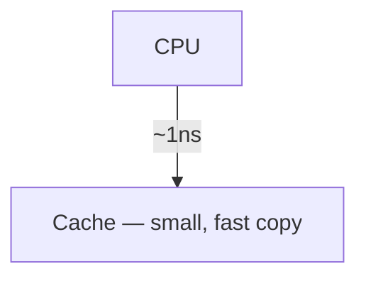

# Mermaid Revealer — Product Specification

**Status:** design draft, v1
**Date:** 2026-07-26
**Companion docs:** [ARCHITECTURE.md](ARCHITECTURE.md) · [AI_PIPELINE.md](AI_PIPELINE.md) · [ENGINE_CHANGES.md](ENGINE_CHANGES.md)

---

## 0. The one-paragraph version

Mermaid Revealer turns a YouTube URL into a **step-by-step animated explanation** of what the video teaches. The AI doesn't just summarize — it decides how the content is *shaped* (a process → flowchart, a protocol → sequence diagram, a history → timeline) and emits diagrams that build up one idea at a time, with a spoken-language caption per step. The user watches the idea assemble itself, annotates on top, quizzes themselves on it, and presents it to a class or team.

The existing revealer engine is the moat. Everyone can call an LLM and get a Mermaid diagram. Almost nobody has a renderer where **every prefix of the diagram is a valid, laid-out, animated frame**. That's a real piece of engineering you already own, and the entire AI pipeline should be designed backwards from its constraints.

---

## 1. Challenging the premise (read this first)

You asked me to challenge assumptions. Six things I'd change before writing a line of backend code.

### 1.1 "YouTube → diagram" is the demo, not the product

A YouTube URL is one input. The *product* is "arbitrary dense explanation → revealable diagram." A PDF paper, a Notion doc, a lecture recording, a pasted transcript, a Confluence runbook, and a GitHub README are all the same shape of problem, and several of them have **no legal or infrastructural risk** and **higher willingness to pay**.

Build the pipeline with a `source` abstraction from day one:

```
Source (youtube | upload | paste | url | pdf) → Transcript/Text → Outline → Diagrams
```

YouTube is the launch wedge because it's the best demo and has the best viral loop. It should not be the only column in your `videos` table — which is why the schema in ARCHITECTURE.md calls it `sources`, not `videos`.

**Why this matters commercially:** the "learn from YouTube" market is consumer, price-sensitive, and churny. The "turn our internal docs into onboarding diagrams" market is B2B, sticky, and pays 20×. Same engine.

### 1.2 YouTube transcript extraction is your single biggest technical risk — bigger than the AI

You listed it as step 3 of the flow in one line. It deserves a third of your engineering worry budget.

- YouTube aggressively blocks datacenter IPs from the `timedtext` endpoint. Convex actions run from cloud IPs. **A naive `youtube-transcript` npm package will work locally and fail in production**, often intermittently, which is the worst failure mode.
- Many videos have no captions, or only auto-generated captions in the wrong language.
- Scraping/downloading is against YouTube's Terms of Service. This is a real legal exposure for a monetized product, not a theoretical one.

The mitigation stack is in ARCHITECTURE.md §7. The product-level implication: **transcript acquisition is a queued, retryable, multi-provider job with a visible failure state**, not a function call. And the ASR fallback (download audio → Whisper/Deepgram) costs *more than the LLM step* for a 60-minute video, so it must be gated behind paid tiers.

### 1.3 The reveal engine can't do 12 diagram types. It can do about 7 well.

Your parser (`js/parser.js`) turns each source line into a reveal step and renders `header + steps[0..i]` at every step. That means **every prefix must be syntactically valid and visually meaningful**. This is true for flowcharts, sequence, state, mindmap, timeline, journey, ER, class, gitGraph. It is **false or useless** for:

- `quadrantChart` — axis/quadrant declarations must all be present before points render; partial prefixes error.
- `pie` — a one-slice pie is 100%; every step rescales the whole chart. Reveal is anti-informative.
- `sankey-beta` — CSV rows are prefix-valid but the layout thrashes violently at every step.
- `xychart-beta` — needs full axis config up front.

Don't let the AI choose these as revealable diagrams. Instead introduce a per-diagram `revealMode: "steps" | "atomic"`. Atomic diagrams render fully in one step and are still useful as summary/data panels. This is a small engine change (ENGINE_CHANGES.md §5) that turns a whole class of runtime errors into a design decision.

### 1.4 Add per-step narration — it's nearly free and it unlocks four features

Your parser already discards `%%` comment lines, and `render.js:167` already reaches for a `#caption` element that doesn't exist in the DOM (it throws — see ENGINE_CHANGES.md §1). The intent was clearly there.

Have the AI emit a one-sentence narration comment before every line:



The parser attaches the narration to the following step. Cost: ~15% more output tokens. What it buys you:

1. **Captions** during study mode (the feature the code already anticipates).
2. **Presenter notes** in presentation mode.
3. **Voice narration** via TTS — a genuinely magical, demo-able feature with zero extra LLM cost.
4. **Flashcard and quiz seeds** — each step is already a discrete atomic claim.
5. **Accessibility** — a screen-reader-navigable text track for a diagram, which almost no diagram tool has.

This is the highest leverage single decision in the spec.

### 1.5 "Cache by video ID" is not enough, and it has a correctness bug

You said: if another user submits the same video, reuse the project. Two problems.

- **Cache key must include more than the video ID.** It must be `hash(sourceId, transcriptHash, promptVersion, model, options)`. Otherwise a prompt improvement, a model upgrade, or a user choosing "detailed" vs "overview" silently serves stale output forever, and you can never ship a quality improvement.
- **You must not share *projects*.** You share *generations*. A project is a user's private, editable, annotated copy. If two users share one project row, user A's edits and annotations leak into user B's workspace. The dedup happens one layer down: cache the expensive artifact (transcript + generated diagram set), then **fork** a cheap per-user project from it.

This distinction is load-bearing throughout the schema.

### 1.6 Rename the tiers

"Gold" reads as a mobile-game currency. Free / **Pro** / **Studio** signals the actual jump (individual → presenting-to-others). Names below use Pro/Studio; substitute if you disagree.

---

## 2. Product overview

### 2.1 Positioning

> **For** students, self-learners, engineers, and educators
> **who** consume dense video content and need to actually retain and re-teach it,
> **Mermaid Revealer** is an AI study environment
> **that** converts any video into interactive diagrams that build up one idea at a time.
> **Unlike** summarizers (which give you text you skim once) or note-taking apps (which make you do the work),
> **we** produce a structured visual artifact you can study, annotate, quiz on, present, and share.

### 2.2 Who it's for (in priority order)

| Segment | Job to be done | Willingness to pay | Priority |
|---|---|---|---|
| CS/engineering students | Turn a 2-hour lecture into something revisable before an exam | Low–medium ($5–15/mo) | P0 — volume, virality |
| Self-taught developers | Understand a dense conference talk or system-design video | Medium ($15/mo) | P0 — best fit |
| Educators / bootcamp instructors | Build lecture visuals in minutes instead of hours | High ($30–50/mo) | P1 — highest LTV |
| Dev-rel / tech content creators | Turn their own video into shareable diagrams | High | P1 — distribution engine |
| Eng teams (internal docs) | Onboarding diagrams from recorded sessions and docs | Very high (seats) | P2 — the real business |

### 2.3 The "magical" moment, defined precisely

Magic is not "AI made a diagram." Magic is **the gap between effort expended and structure received**. Concretely, the first-run experience must be:

1. Paste URL. **Under 2 seconds** you see the video title, thumbnail, duration, and a live progress trace ("Fetching transcript… Found 47 min of captions… Detected 5 topics… Building diagram 2 of 5…").
2. The **first diagram becomes interactive before the rest finish generating**. Do not make the user wait for the whole batch. Stream diagram-by-diagram into the sidebar.
3. The first thing they see is not a static picture — it's the diagram **animating itself into existence** on autoplay, once, with captions. Then it resets and hands them the controls.

That third point is the whole demo. Your engine already does the animation (`markNewElements`, staggered entrance). Autoplay-once-on-first-view is a ~20-line change and it is the difference between "neat" and "whoa."

---

## 3. User flows

### 3.1 First-run (unauthenticated → activated)

```
Landing page
  └─ URL input, prominent, above the fold. No signup wall.
     └─ [Generate]
        ├─ Anonymous users get ONE free generation, no account.
        │    Rate limited by IP + Turnstile challenge.
        │    The result is held in a temp workspace for 24h.
        └─ Live progress trace (reactive, not a spinner)
           └─ First diagram ready → auto-plays once with captions
              └─ User steps through, zooms, annotates
                 └─ Soft wall on VALUE actions only:
                    Save · Export · Share · Generate #2
                    └─ Google Sign-In (one click, no password)
                       └─ Temp workspace merges into their account
```

**Rationale for the anonymous first generation:** the product's value is impossible to convey in a screenshot and trivially obvious in 30 seconds of use. Requiring auth before the first result will cost you more in top-of-funnel than the free generations cost in COGS (~$0.13 each, gated hard by Turnstile + IP rate limit + a curated allowlist of "safe" demo videos if abuse becomes real).

### 3.2 Core generation flow (authenticated)

```
1. Paste YouTube URL (or drop a PDF / paste text / add a doc URL)
2. Normalize → canonical videoId (handle youtu.be, /shorts, /live, &t=, playlists)
3. Cache probe: hash(sourceId, transcriptHash, promptVersion, model, depth)
   ├─ HIT  → fork a project from the cached generation. ~200ms. 0 credits.
   │         Show "Instant — this video was already mapped ⚡" (this is a
   │         FEATURE, not a shortcut to hide. It makes popular videos feel free.)
   │         Offer "Regenerate fresh" (costs credits).
   └─ MISS → enqueue generation job
              ├─ Debit credits optimistically; refund on failure
              ├─ Stage 1: acquire transcript (multi-provider, retryable)
              ├─ Stage 2: outline + segmentation  (cheap model)
              ├─ Stage 3: per-section diagram generation (parallel, streamed)
              ├─ Stage 4: validate + auto-repair each diagram
              └─ Stage 5: materialize project, notify
4. Diagrams stream into the sidebar as they complete
5. First diagram auto-plays once → user takes over
```

### 3.3 Study loop (the retention engine)

```
Project open
 ├─ Reveal mode    ← what you have today: ← → through steps
 ├─ Study mode     — step + narration caption + "explain this step" AI popover
 ├─ Recall mode    — a step is hidden; user predicts the next node, then reveals
 ├─ Quiz           — generated MCQ/short-answer, graded, wrong answers deep-link
 │                   to the exact diagram step that teaches it
 └─ Flashcards     — FSRS-scheduled, each card links back to its step
```

The deep link from a wrong quiz answer back to `project/:id/diagram/:n/step/:k` is the feature that makes this a *learning* product rather than a *diagram* product. It is cheap to build and very hard for a summarizer competitor to copy.

### 3.4 Presentation flow

```
Present → fullscreen, chrome hidden
 ├─ ← → / Space steps through
 ├─ Presenter view (second window): current step, narration, next step preview, timer
 ├─ Laser pointer (hold L) + live annotation (D)
 ├─ Audience link: read-only, follows the presenter live (Convex reactive query —
 │   this is nearly free with Convex and would be a websocket project elsewhere)
 └─ B = blank, R = reset, G = go-to-step palette
```

### 3.5 Share flow

```
Share
 ├─ Private link (unlisted, token, optional expiry, optional password)
 ├─ Public page (SEO-indexed: /d/{slug} — "Interactive diagram: <video title>")
 ├─ Embed iframe (allowlisted domains; free tier keeps the watermark)
 └─ Export: SVG · PNG · PDF (multi-page, one page per step) · PPTX · .mmd · Markdown
```

**The public share page is your growth engine.** Every shared diagram is an indexable landing page titled with a real search query ("How does TCP handshake work — interactive diagram"). The reveal animation runs on load. There's a "Make your own from any YouTube video" CTA. Budget real design effort here.

---

## 4. Feature list

### 4.1 P0 — MVP (nothing ships without these)

| Feature | Notes |
|---|---|
| Google Sign-In | Convex Auth or Clerk. One provider only at launch. |
| YouTube URL → diagram set | The core loop |
| Transcript acquisition w/ fallbacks | Multi-provider; see ARCHITECTURE.md §7 |
| Automatic topic segmentation | One project can hold 3–8 diagrams |
| AI diagram-type selection | Not always a flowchart |
| Step-by-step reveal | **Exists.** Port to the app shell. |
| Per-step narration captions | New; see §1.4 |
| Auto-play first reveal | ~20 lines; enormous demo value |
| Zoom / pan / fit / fullscreen | **Exists.** |
| Project sidebar, reorder, delete | **Exists** (`nav.js`), needs persistence |
| Server-side validation + auto-repair | Non-negotiable; see AI_PIPELINE.md §6 |
| Cache by content hash | The unit economics depend on it |
| Credit ledger + usage limits | Append-only, auditable |
| Polar checkout + webhooks | Free/Pro/Studio |
| Export SVG + PNG | Client-side, cheap |
| Private share link | |
| Reactive generation progress | Convex makes this ~free |

### 4.2 P1 — the retention layer (ship within 8 weeks of MVP)

- **AI tutor sidebar** — chat scoped to *this* transcript + *these* diagrams. RAG over transcript chunks (Convex vector search). Cite timestamps; clicking a citation jumps the embedded YouTube player.
- **"Explain this step"** — click any node → 2-sentence explanation, grounded in the transcript span that produced it. Cheap (Haiku), high perceived value.
- **Flashcards + FSRS spaced repetition** — generated from step narrations. Daily review queue. This is what makes people come back on day 7.
- **Quiz generation** with step deep-links.
- **Annotation system** — draw, highlight, arrow, text note, multi-layer, undo/redo, persisted. See §6.
- **Presentation mode + presenter view + live audience follow.**
- **Diagram editor** — split-pane Mermaid source ⟷ live preview, with the step boundaries visualized. Users *will* want to fix the AI's output; letting them is a trust-builder, and their edits are free training signal.
- **PDF / PPTX export.**
- **Public share pages** (SEO).
- **Search across all projects** (Convex full-text over titles, narrations, node labels).

### 4.3 P2 — differentiation

- **Course builder** — chain a playlist into a multi-lesson course with a progress track and a certificate-ish completion state. Playlist ingestion is a batch job; this is where Studio pricing earns out.
- **Voice narration** — TTS over the per-step narration, synced to the reveal. Turns a diagram into a 3-minute explainer video. Also → **video export (MP4)**, which is inherently shareable on social and is your best organic growth loop.
- **Multi-language** — generate diagrams in the user's language from an English transcript. Genuinely underserved; near-zero marginal cost.
- **Diagram styles/themes** — you already have 6 accent colors + light/dark (`theme.js`). Extend to named presets (Blueprint, Chalkboard, Whiteboard, Neon, Print) and let Studio users save a brand theme.
- **Compare mode** — two videos on the same topic, diagrams side by side, AI-highlighted differences. Nobody does this.
- **Browser extension** — a "Mermaid Revealer" button on the YouTube watch page. Best acquisition channel per dollar.
- **Team workspaces** — shared projects, comments, roles.

### 4.4 P3 — the actual business

- **Docs/PDF/Confluence/Notion ingestion** (see §1.1)
- **API** — `POST /v1/generate` with a source, get diagrams back. Sell to LMS platforms, dev-tool docs sites, corporate L&D.
- **LMS integrations** — Canvas, Moodle, Google Classroom (LTI).
- **SSO + SOC2** — the tax on selling to organizations.

### 4.5 Features beyond your list worth stealing from nobody

These are the ones I'd add that aren't in your brief:

1. **Timestamp-linked steps.** Each reveal step carries the transcript timestamp it came from. Click the step → the embedded YouTube player seeks there. This single feature makes the diagram a *navigation index* for the video, which is a different and more defensible product than a summary.
2. **"Where did this come from?"** — hover any node, see the exact transcript quote. This is your hallucination defense, made into a feature. It converts the LLM's biggest liability into a visible trust signal.
3. **Diff-on-regenerate.** When a user regenerates, show what changed rather than silently replacing. Users are protective of artifacts they've annotated.
4. **Reveal-order editing.** Let a user drag steps to change the reveal order without touching Mermaid source. This is *your* unique primitive — no other tool has an editable reveal order because no other tool has reveals.
5. **Confidence flagging.** Where the model was uncertain (short transcript span, low-signal audio), mark the step. Honest > authoritative.

---

## 5. UX recommendations

### 5.1 Keep the aesthetic

The existing design (IBM Plex Mono, dark-first, accent-switchable, `// terminal-comment` placeholders) is opinionated and good. It reads as a tool for technical people, which is exactly your P0 audience. **Do not redesign it into another rounded-corner purple-gradient SaaS.** Extend it:

- Keep the mono/sans pairing and the accent-swatch row.
- Keep the `//`-prefixed empty states.
- Add a light theme that is a real design, not an inversion (print/classroom use is a Studio-tier use case).

### 5.2 Layout

```
┌────────────────────────────────────────────────────────────────┐
│ ◆ project title            [Study][Present][Share][Export]  ◐ ⬤⬤⬤│
├──────────────┬─────────────────────────────────────┬───────────┤
│ DIAGRAMS     │                                     │ AI TUTOR  │
│ 01 Overview  │                                     │ (collaps.)│
│ ▸ 02 Cache   │           canvas / viewport         │           │
│ 03 Locality  │        (existing zoom/pan)          │  chat     │
│              │                                     │  scoped   │
│ ── tools ──  │                                     │  to this  │
│ ✎ 🖍 → ✍ ↺   │                                     │  project  │
├──────────────┴─────────────────────────────────────┴───────────┤
│ "A cache is a small, fast copy of memory next to the CPU."     │ ← narration
│ ← [ ██████████░░░░░░░ ] →   7/12    ▶ autoplay  ⏱ 4:12        │
└────────────────────────────────────────────────────────────────┘
```

Three collapsible panels; the canvas is always the hero. On mobile, panels become bottom sheets and the canvas keeps ~70% of the viewport.

### 5.3 Interaction rules

- **Progress is always visible.** You have a progress bar; add the step-count-per-diagram in the sidebar (already in `updateNavState`) and an overall project progress ring.
- **Never a bare spinner.** Generation shows a named-stage trace. Users forgive 40 seconds of visible work and abandon 15 seconds of a spinner.
- **Optimistic everything.** Convex mutations + optimistic updates: annotations, reorders, renames should feel instant.
- **Keyboard first.** `→ ←` steps (exists), `j/k` diagrams, `f` fit, `+/-` zoom, `Space` autoplay, `p` present, `d` draw, `e` erase, `Cmd+K` command palette, `?` shortcuts overlay.
- **Reduced motion.** Respect `prefers-reduced-motion` — disable entrance animations, keep the reveal. Currently unhandled.

### 5.4 Accessibility (also an SEO and enterprise-sales asset)

- Per-step narration → an ARIA live region announcing each reveal.
- Full keyboard navigation of the canvas.
- The narration track is a text alternative to the diagram — ship it as a downloadable outline. This is the accessible-format story that gets you into universities.

### 5.5 Empty and failure states

Every failure the pipeline can produce needs a designed state with a real next action:

| Failure | What the user sees |
|---|---|
| No captions available | "This video has no captions. Transcribe the audio instead? (2 credits)" — Pro+ only |
| Transcript provider blocked | Silent retry across providers; user only sees it after all fail |
| Video too long (>4h) | "This is 5h 12m. Generate the first 2 hours, or split into parts?" |
| Video is music/no speech | "We couldn't find enough spoken content to map." Refund credits automatically. |
| Diagram failed validation after repair | Show the other diagrams; mark this one "couldn't render" with a one-click retry. **Never fail the whole project for one bad diagram.** |
| Out of credits | Show exactly what it would cost and what the next tier gives. No dark patterns. |

---

## 6. Annotation system

### 6.1 Requirements

Draw, highlight, scratch/mark, circle, sticky notes, arrows, multiple layers, undo/redo, persistence, and (P2) real-time collaboration.

### 6.2 Design

**Coordinate space.** Store all annotation geometry in **diagram-space** (the SVG's `viewBox` coordinate system), never screen pixels. The canvas already applies `translate(tx,ty) scale(s)` (`render.js:applyTransform`); the annotation overlay must sit inside the same transformed container so annotations track zoom/pan for free. Screen-space storage breaks the moment the user zooms or opens the project on a different screen size.

**Step binding.** Every annotation records the `stepIndex` at which it was created and a `visibility` policy:
- `from-step` (default): visible from its creation step onward — matches how you annotate while teaching.
- `pinned`: always visible.
- `step-only`: visible on exactly that step.

This makes annotations work *with* the reveal instead of floating over it, and it's something no generic whiteboard tool can do.

**Storage model — ops, not blobs.** Do not store one JSON blob per layer. Store an append-only op log:

```ts
annotationOps: {
  layerId, projectId, diagramId,
  seq,                      // monotonic per layer
  op: "add" | "update" | "delete",
  shape: { kind: "ink"|"highlight"|"arrow"|"ellipse"|"rect"|"text",
           points?, from?, to?, bbox?, text?, color, width, opacity },
  stepIndex, visibility,
  authorId, createdAt
}
```

Why: undo/redo is a seq pointer, not a diff engine; multiplayer merges naturally later; and Convex's 1MB document limit makes a growing blob a ticking bomb on a heavily-annotated diagram. Periodically compact settled ops into a snapshot to bound read cost.

**Ink capture.** Pointer Events (covers mouse, trackpad, stylus, touch), pressure-sensitive width where available, Catmull-Rom smoothing, and Ramer–Douglas–Peucker simplification on commit (a raw 4000-point stroke becomes ~120 points with no visible loss). Batch-write on `pointerup`, not per-move.

**Layers.** Named, reorderable, per-layer visibility and opacity. Default layers: "My notes" and, for shared projects, one auto-layer per collaborator.

---

## 7. Pricing strategy

### 7.1 The unit that gets metered

You asked whether to limit by AI credits, videos, tokens, generations, or storage. **Limit by credits, where 1 credit = 30 minutes of source video, rounded up.**

Reasoning:
- **Tokens** are invisible to users. Never expose them.
- **Videos/generations** decouple price from cost — a 10-minute video and a 3-hour lecture cost you 18× apart but consume identically. That's how you get destroyed by power users.
- **Storage** is irrelevant; Mermaid source is kilobytes. Never meter it. (Cap it generously and forget about it.)
- **Credits scaled by duration** track your actual cost driver almost linearly, and users understand "a 90-minute lecture costs 3 credits" immediately.

Secondary meters (limits, not currency): AI tutor messages/day, exports/month, seats.

| Action | Credits |
|---|---|
| Generate from cached video (cache hit) | **0** — this is a feature, advertise it |
| Generate, ≤30 min source | 1 |
| Generate, per additional 30 min | +1 |
| Force regenerate | Same as generate |
| Audio transcription fallback (no captions) | +2 per 30 min (this genuinely costs more than the LLM) |
| Premium model (Opus-tier "deep" mode) | ×2 |
| Quiz / flashcard generation | 0 (bundled) |
| AI tutor message | 0, but rate-limited per tier |
| Export, share, annotate | 0, always |

### 7.2 Cost model (verified pricing, 2026-07)

Anthropic list prices: **Claude Opus 5** $5/$25 per MTok · **Claude Sonnet 5** $3/$15 (intro $2/$10 through 2026-08-31) · **Claude Haiku 4.5** $1/$5. Batch API is **50% off**; prompt-cache reads are **~0.1×** input price, writes 1.25× (5-min TTL).

Typical 60-minute video ≈ 9,000 words ≈ **12K input tokens**.

| Stage | Model | Tokens | Cost |
|---|---|---|---|
| Outline + segmentation | Haiku 4.5 | 12K in / 1.5K out | $0.020 |
| Diagram generation (5 sections, transcript prompt-cached) | Sonnet 5 | 12K cache-write + 5×12K cache-read / 6K out | $0.045 + $0.018 + $0.090 = $0.153 |
| Validation/repair (≈20% of diagrams need one pass) | Haiku 4.5 | ~2K / 1K | $0.007 |
| **Total, interactive path** | | | **≈ $0.18** |
| Same job on the Batch API (background, non-urgent) | | | **≈ $0.09** |
| "Deep" mode on Opus 5 | | | **≈ $0.42** |
| Transcript (caption API) | | | $0.001–0.01 |
| Transcript (ASR fallback, 60 min) | | | **$0.25–0.40** ⚠️ |

Two conclusions that should drive the whole pricing design:

1. **The ASR fallback can cost more than everything else combined.** Gate it to paid tiers, charge extra credits, and cache the resulting transcript globally and forever.
2. **Batch mode halves your cost.** Offer it as a product feature: "Queue it — ready in ~10 minutes, costs half the credits." Many students genuinely don't need it in 40 seconds, and you should let them trade latency for credits.

Assume a **35–50% cache-hit rate** at any real scale (popular educational videos concentrate hard — the top few thousand CS/math videos will be a large fraction of all submissions). Blended cost per generation lands near **$0.10**.

### 7.3 The plans

#### Free — $0

- **10 credits/month** (≈ five 60-minute videos)
- Cache hits are **unlimited and free** — you can study any already-mapped video forever
- 5 saved projects, 3 diagrams per project cap
- Annotations: 1 layer
- Export: PNG, SVG (watermarked)
- Share: private link only
- AI tutor: 15 messages/day
- No ASR fallback, no batch queue

*Design intent:* generous enough that a student can genuinely use it during finals week; the unlimited cache-hit allowance makes the free tier feel abundant while costing you nothing. That's the trick — **free users overwhelmingly hit popular videos, which are already cached.**

#### Pro — **$14/month** or **$120/year** (29% off)

- **120 credits/month**, rolling over up to 240
- Unlimited saved projects
- Unlimited annotation layers, full undo history
- Export: PNG, SVG, PDF, Markdown, `.mmd` — no watermark
- Public share pages + embeds
- Presentation mode + presenter view
- Flashcards, spaced repetition, quizzes
- AI tutor: 500 messages/month
- ASR fallback for caption-less videos
- Batch queue (half-credit generations)
- Diagram editing
- Priority queue

*COGS at heavy use (120 credits ≈ 60 hours of video, ~35% cached): **≈ $8**. Gross margin ~43% on the worst-case user; realistic median user consumes 20–30 credits → **~92% margin**.* Charge annually where you can — it fixes both cash flow and the credit-hoarding problem.

#### Studio — **$39/month** or **$348/year**

Everything in Pro, plus:

- **400 credits/month**, rollover to 800
- **Deep mode** (Opus-tier generation) — visibly better diagrams on hard technical content
- Course builder (playlist → multi-lesson course)
- Voice narration (TTS) + **MP4 video export**
- PPTX export + custom brand themes (logo, palette, fonts)
- Multi-language generation
- Team workspace, 3 seats included (+$12/seat)
- Comments on diagrams
- Custom domain for share pages
- API access (1,000 calls/month)
- Email support, 24h

*Target buyer: instructors, bootcamps, dev-rel, content creators. These people are buying **billable-hour replacement**, not a study tool. $39 is cheap against 4 hours of slide-making.*

#### Education / Campus (P2, quote-based)

Per-seat, annual, LMS integration, SSO, admin dashboard. Price at $4–6/student/year in bulk. This is where the volume is if the product works.

### 7.4 Pricing mechanics that matter

- **Anchor on the cache.** Every cache hit should say "⚡ Instant — 0 credits." It makes the product feel generous and it's your cheapest retention lever.
- **Never hard-stop mid-generation.** If a user runs out mid-job, finish the job and take them to −N credits. Recovering a bad moment costs more than the $0.18.
- **Refund on failure, automatically and visibly.** "That video had no usable speech — your 2 credits are back."
- **Credit top-ups**: 50 credits for $7, no expiry. Captures the exam-week spike without a tier upgrade, and converts churny users into occasional payers.
- **Annual default.** Show annual first with the discount pre-applied.
- **Student discount**: 50% off Pro with a `.edu` address. Cheap goodwill, strong word-of-mouth in exactly your target segment.

### 7.5 Why Polar.sh is the right call

Polar is a **Merchant of Record** — it handles global VAT/GST/sales-tax registration and remittance, which for a solo founder selling to students in 40 countries is worth vastly more than the fee delta versus raw Stripe. It has first-class usage-based billing, a hosted customer portal, license keys, and a genuinely good DX. There's a Convex component for it.

Caveats, stated honestly:
- Polar is younger than Paddle/Lemon Squeezy. Mitigate by keeping **entitlement state in your own DB** (`subscriptions` + `entitlements` tables) and treating Polar as a payment/webhook source only. Never call Polar's API in the request path to decide whether a user can do something. If you ever have to migrate, it's a webhook adapter, not a rewrite.
- Store `polarCustomerId` and `polarSubscriptionId`, dedupe webhooks by event ID (`webhookEvents` table), and reconcile nightly against Polar's API for missed events.

---

## 8. Competitive advantages

Ranked by defensibility.

1. **The reveal engine.** Progressive, prefix-valid, animated, per-step-navigable Mermaid rendering with stable-key diffing so unchanged nodes don't re-flash (`render.js:collectRenderKeys`). This is genuinely non-trivial and it's already built. No competitor has it.
2. **Reveal-aware AI generation.** Once the prompt is tuned to emit prefix-valid, one-idea-per-line, narrated Mermaid, you have a model output format that only your renderer can fully exploit. A competitor copying your prompt gets a static diagram.
3. **The cache network effect.** Every generated video makes the product faster and cheaper for the next user of that video. At scale you have a corpus of pre-mapped educational content that is expensive to replicate — and a set of SEO landing pages that competitors would need to generate (and pay for) one by one.
4. **The study loop.** Diagram → narration → flashcard → quiz → deep-link back to the step. Summarizer tools produce artifacts; you produce a *practice system*. Retention is a moat.
5. **Timestamp grounding.** Every step traces to a transcript span with a timestamp. Trust + navigation + hallucination defense in one mechanism.
6. **Video export.** A 3-minute animated diagram explainer with voice narration, generated from a URL, is intrinsically shareable. This is a growth loop, not just a feature.

What is **not** a moat: "we use AI," the Mermaid renderer itself, YouTube ingestion, or export formats. Don't invest marketing in those.

---

## 9. Risks

| # | Risk | Severity | Mitigation |
|---|---|---|---|
| R1 | **YouTube blocks transcript extraction** | 🔴 Critical | Multi-provider chain + residential proxies + ASR fallback + aggressive permanent caching. Treat provider failure as normal, not exceptional. Detail in ARCHITECTURE.md §7. |
| R2 | **YouTube ToS / legal** | 🔴 High | Get counsel before monetizing. Prefer licensed transcript APIs over self-scraping. Never store or serve video/audio. Respond to takedowns fast. Diversify inputs early (§1.1) so YouTube isn't a single point of business failure. |
| R3 | **Copyright on generated diagrams** | 🟠 Medium | Diagrams are transformative structural abstractions, not reproductions — but don't reproduce transcript verbatim beyond short quotes. Cap "source quote" popovers at ~25 words. Give creators an opt-out and a claim process for their content. |
| R4 | **Hallucinated / wrong diagrams** | 🟠 Medium-High | Grounding + timestamp citations + "where did this come from" + confidence flags + easy editing + a report button. Wrong diagrams in an *education* product are a trust catastrophe, not a bug. |
| R5 | **Mermaid XSS via generated/pasted source** | 🟠 Medium | `securityLevel: 'strict'`, `htmlLabels: false`, sanitize labels server-side, strip `click`/`href` directives, render shared diagrams in a sandboxed iframe with CSP. See ENGINE_CHANGES.md §7. **This is a live vulnerability the moment you allow public sharing.** |
| R6 | **Unit economics break on power users** | 🟠 Medium | Duration-scaled credits (§7.1), rollover caps, batch tier, per-user cost dashboard, hard ceiling with a human-in-the-loop override. |
| R7 | **Convex limits bite** (1MB docs, no headless browser, limited analytics SQL) | 🟡 Medium | Transcripts → file storage. Render/export → a separate Playwright sidecar. Analytics → PostHog/Tinybird. Planned for in ARCHITECTURE.md §2. |
| R8 | **Google/OpenAI ships this** | 🟡 Medium | NotebookLM already does audio overviews; a diagram mode is plausible. Your defense is depth in the study loop and the reveal primitive, not breadth. Move to B2B/education before the consumer layer commoditizes. |
| R9 | **Mermaid can't express what the content needs** | 🟡 Medium | Accept it. Mermaid's constraints are also what make the format cheap and editable. Add a small set of custom node styles rather than fighting toward a general diagramming engine. |
| R10 | **Cold-start: empty cache means every early user pays full latency** | 🟡 Low-Medium | Pre-generate the top ~2,000 educational videos (CS50, 3Blue1Brown, freeCodeCamp, MIT OCW, StatQuest…) before launch. ~$200 of inference buys you an instant-feeling product on day one *and* 2,000 SEO landing pages. Do this. |

---

## 10. Roadmap

### Phase 1 — MVP (weeks 1–8)

**Goal:** one person can paste a URL and get a diagram set worth sharing.

- Weeks 1–2: Convex project, schema, Google auth, port the existing engine into the app shell with persistence
- Weeks 3–4: transcript acquisition (multi-provider + fallbacks), outline stage, generation stage, validation/repair
- Weeks 5–6: caching + fork, credits + ledger, Polar checkout + webhooks, streaming progress UI
- Week 7: export (PNG/SVG), share links, public share page
- Week 8: pre-generate the top 2,000 videos; polish; private beta

**Exit criteria:** p50 generation < 45s · ≥90% of generated diagrams render without repair · 60% of first-time users complete a full reveal

### Phase 2 — retention (weeks 9–20)

Annotations (full system) · study/recall modes · flashcards + FSRS · quizzes with step deep-links · AI tutor (RAG over transcript) · presentation mode + presenter view · diagram editing · PDF/PPTX export · search · browser extension · **public launch**

**Exit criteria:** D7 retention ≥ 25% · free→paid ≥ 4% · ≥1 diagram shared per 5 generated

### Phase 3 — expansion (months 6–10)

Course builder from playlists · voice narration + MP4 export · multi-language · themes & branding · team workspaces + comments · non-YouTube sources (PDF/docs/URL) · Studio tier launch

**Exit criteria:** Studio ≥ 15% of revenue · a repeatable acquisition channel with CAC < 3-month LTV

### Phase 4 — platform (months 10–18)

Public API · LMS/LTI integrations · SSO + SOC2 · education/campus pricing · usage analytics for instructors · self-serve enterprise

**Exit criteria:** ≥ 30% of revenue from teams/institutions

### What to deliberately *not* build

- Real-time multiplayer editing (huge cost, tiny demand at your stage — live *presentation following* covers 90% of the value for 5% of the work)
- A general-purpose diagram editor (you'd be competing with Excalidraw and Miro on their turf)
- Mobile native apps (responsive web is sufficient; revisit if flashcards drive mobile demand)
- Your own ASR model
- More than one auth provider at launch

---

## 11. Success metrics

| Layer | Metric | Target by end of Phase 2 |
|---|---|---|
| Acquisition | Weekly signups | 1,000 |
| Activation | % completing a full reveal on day 1 | 60% |
| Activation | Time to first diagram (p50) | < 45s |
| Engagement | Projects per active user per week | 3 |
| Engagement | % using study mode or flashcards | 30% |
| Retention | D7 / D30 | 25% / 12% |
| Virality | Shares per 10 generations | 2 |
| Monetization | Free → paid conversion | 4% |
| Monetization | Gross margin | > 80% |
| Quality | Diagrams rendering w/o repair | > 90% |
| Quality | User regeneration rate (a proxy for "the AI got it wrong") | < 15% |
| Cost | Cache hit rate | > 40% |
| Cost | Blended AI cost per generation | < $0.12 |

---

## 12. Open questions for you

1. **Legal posture on YouTube.** Are you willing to pay for a licensed transcript API and take the ToS risk, or does this need to become a "bring your own transcript / upload your own video" product to be safe? This decision changes the architecture.
2. **Consumer or B2B first?** The spec above hedges. If you want the bigger business, invert Phases 3 and 4 and put docs/PDF ingestion in Phase 2.
3. **Solo or team?** Phase 1 is ~8 weeks solo at high intensity, or ~4 with a second engineer. Convex is chosen partly on the assumption you're solo.
4. **Do you already have Anthropic/OpenAI spend?** The pre-generation strategy (R10) needs ~$200 of budget and is the single highest-ROI pre-launch action in this document.
